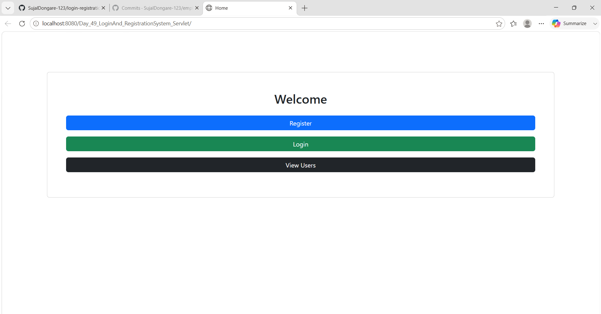
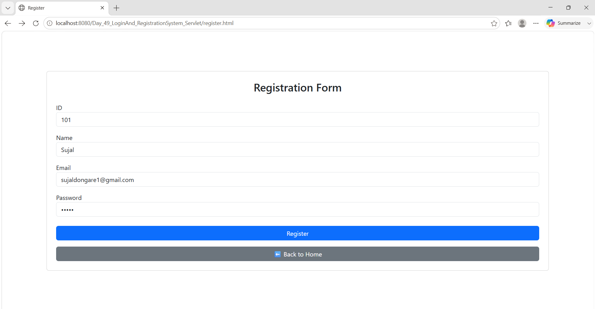
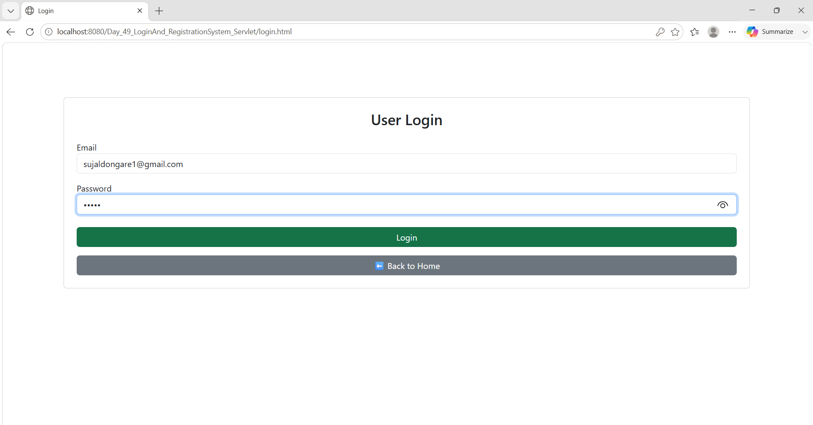
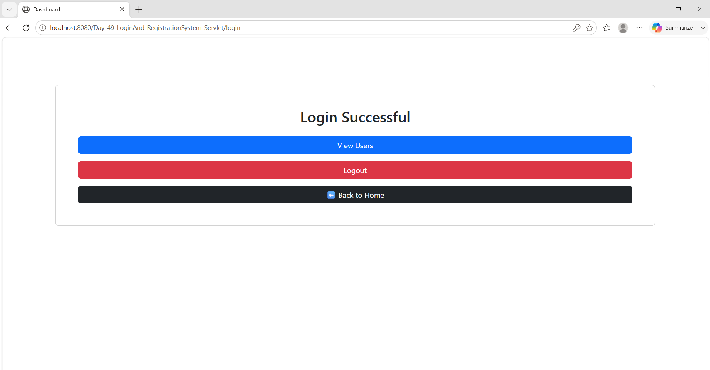
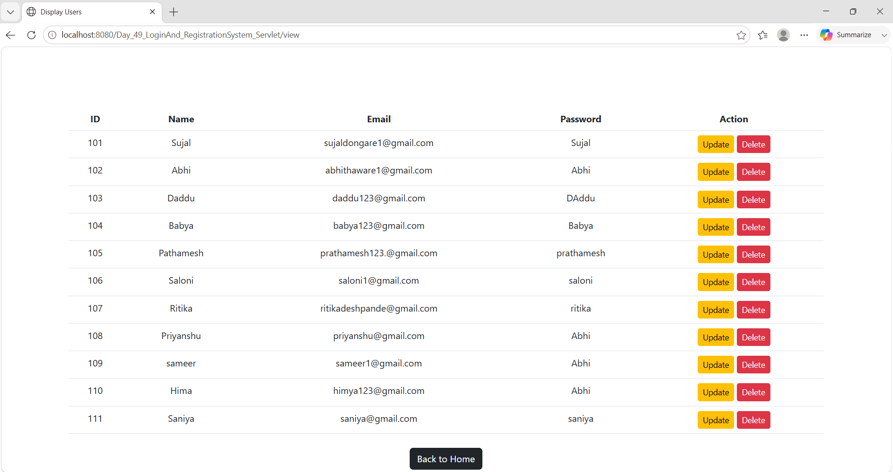
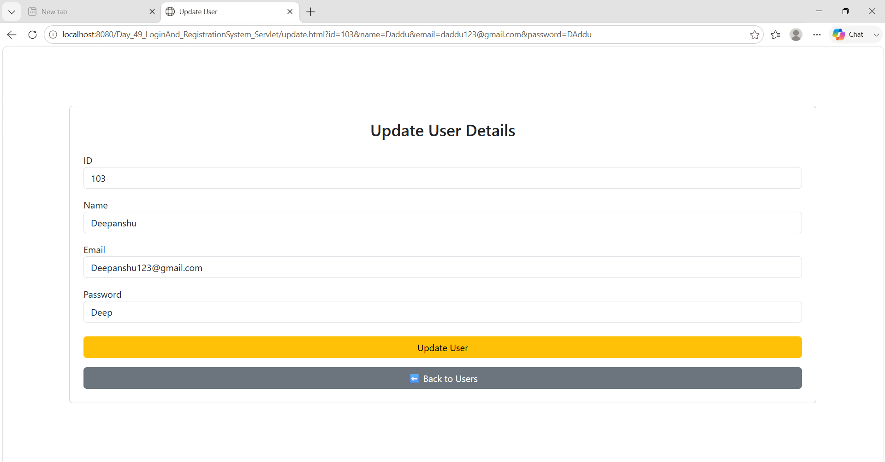
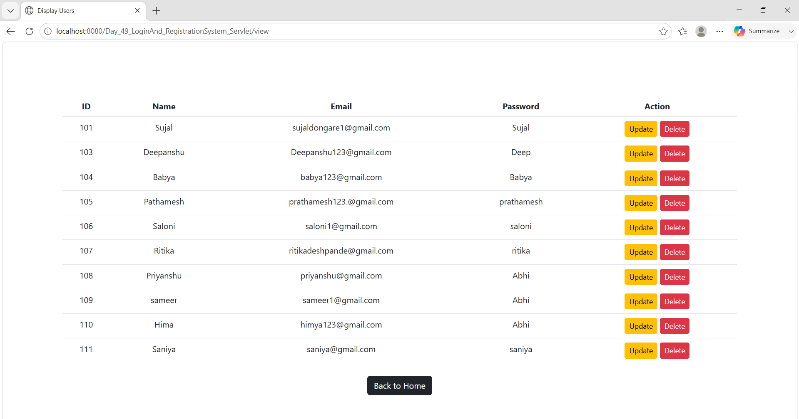
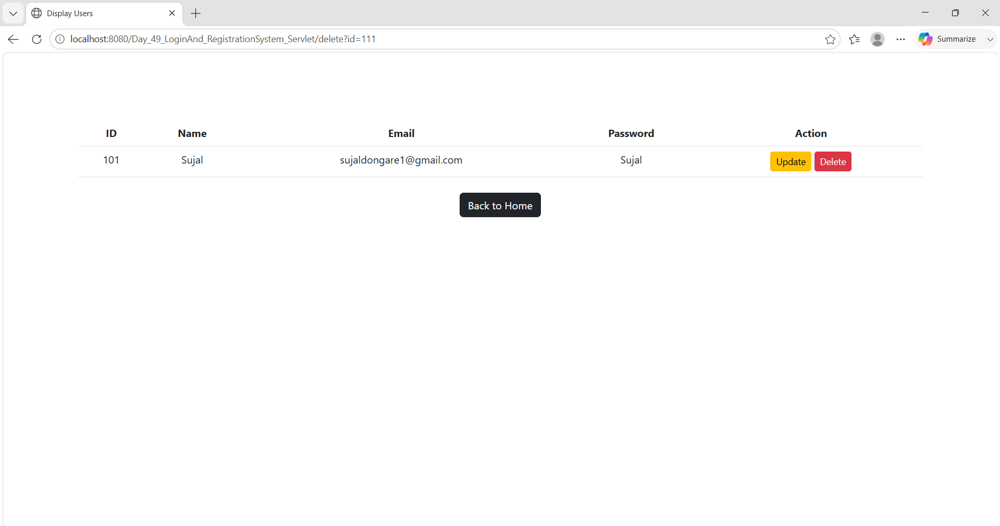
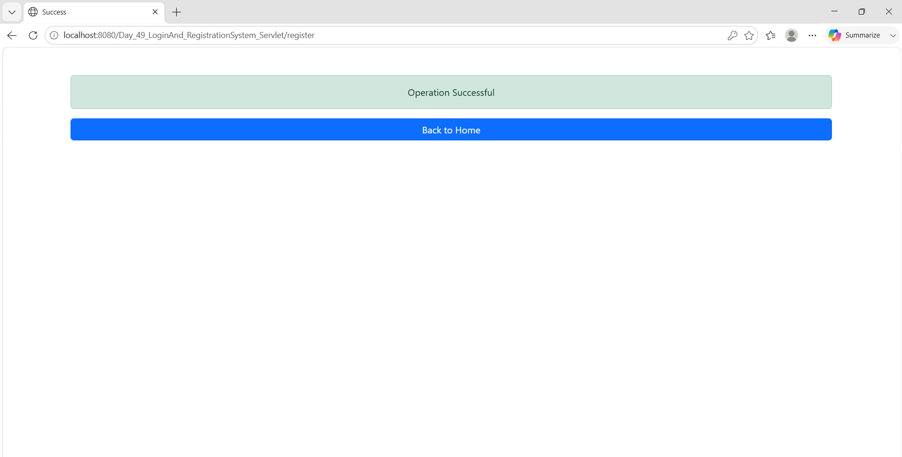
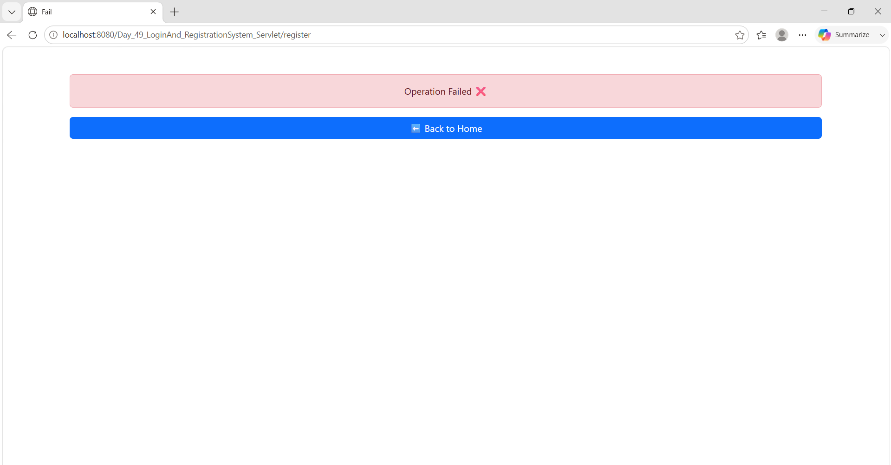

# Day_49_LoginAnd_RegistrationSystem_Servlet

Login and Registration System built using Java Servlet, JSP, JDBC, MySQL, HTML, CSS, and Apache Tomcat.

## Features

- User registration
- User login
- User logout
- View users
- Update user details
- Delete user
- Dashboard page
- Success and failure pages

## Tech Stack

- Java
- Servlet and JSP
- JDBC
- MySQL
- HTML and CSS
- Apache Tomcat
- Eclipse IDE

## Project Structure

```text
src/main/java       Java source code
src/main/webapp     HTML, JSP, CSS, WEB-INF, and libraries
```

## Database

This project uses a MySQL database named `Login_db`.

The database connection is configured in:

```text
src/main/java/in/soft/factory/ConnectionFactory.java
```

Update the username and password according to your local MySQL setup before running the project.

## How To Run

1. Open Eclipse IDE.
2. Import this folder as an existing Eclipse project.
3. Configure Apache Tomcat in Eclipse.
4. Create the MySQL database `Login_db` and the required user table.
5. Run the project on the configured Tomcat server.`r`n`r`n## Screenshots

### Home Page



### Registration Form



### Login Page



### Login Successful Page



### Display User List



### Update User Page



### Updated User List



### Deleted User List



### Success Page



### Failure Page



